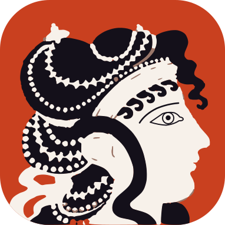

  

<h1 align="center">
  <picture>
    <source media="(prefers-color-scheme: dark)" srcset="journal/assets/2026-10-10-wordmark-dark.svg">
    
  </picture>
</h1>

NS 차트([Nassi-Shneiderman Diagram](https://en.wikipedia.org/wiki/Nassi%E2%80%93Shneiderman_diagram)) 편집기입니다. 블록을 고르고 감싸는 **구조 편집**으로 차트를 그리면, 레이아웃은 자동으로 맞춰집니다. 저장 파일은 어디서나 열리는 SVG 그림이면서, 다시 열어 편집할 수 있는 원본입니다.

Obsidian 플러그인, 데스크톱 앱, 웹(정적 페이지)으로 배포할 예정입니다.

> [!NOTE]
> **지금은 설계 단계입니다.** 요구사항과 아키텍처 결정을 정리하고 있으며, 코드는 아직 없습니다.

## 이 저장소를 읽는 법

> [!TIP]
> 이 저장소의 문서는 [Obsidian](https://obsidian.md/)으로 쓰고 읽도록 만들었습니다. `[[위키링크]]`, 블록 ID, 태그, 콜아웃을 쓰기 때문에 GitHub에서는 문서 사이의 링크가 동작하지 않고 일부가 글자 그대로 보입니다.
>
> **Obsidian으로 보는 법:** 저장소를 내려받은 뒤(`git clone` 또는 Code → Download ZIP), Obsidian에서 **Open folder as vault**로 저장소 폴더를 엽니다. [`docs/README.md`](docs/README.md)에서 시작하세요.

| 폴더 | 내용 |
| --- | --- |
| [`docs/`](docs/README.md) | 애플리케이션 문서: 요구사항, 아키텍처, 아키텍처 결정 기록(ADR), 설계, 파일 형식 명세 |
| [`plan/`](plan/README.md) | 일하기 위한 기록: 현재 상태, 부채 목록, 세션 기록, inbox |
| [`journal/`](journal/README.md) | 여정 기록: 타임라인, Claude Code 초보자의 배움 기록 |
| [`tech-notes/`](tech-notes/README.md) | 백엔드 개발자가 프론트엔드를 배우며 정리한 기술 노트 |

## 어떻게 만들고 있나

이 프로젝트는 **Claude Code를 처음 쓰는 백엔드 개발자**가 AI와 함께 프론트엔드 앱을 만들어 가는 과정이기도 합니다.

요구사항을 정하고, 결정의 근거를 ADR로 남기고, 세션마다 무엇을 의논했는지 기록합니다. 그 과정에서 겪은 실수와 배움도 그대로 남깁니다. 누구라도 이 기록을 따라가 보며 "나도 해 볼 수 있겠다"는 용기를 얻기를 바랍니다.

- 처음부터 지금까지의 흐름: [`journal/timeline.md`](journal/timeline.md)
- AI와 일하는 법을 배워 간 기록: [`journal/learning-claude-code.md`](journal/learning-claude-code.md)

## 이름

`AriadneNSD`는 "아리아드네의 NS 차트"입니다. 그리스 신화에서 아리아드네는 미궁에 들어가는 테세우스에게 실타래를 건네, 그 실을 따라 되돌아 나올 수 있게 했습니다. 그래서 "아리아드네의 실(Ariadne's Thread)"은 복잡한 곳에서 길을 잃지 않게 해 주는 것을 뜻합니다. 코드라는 미궁을 지나는 실이 NS 차트(NSD)라는 생각으로, 문자 로고에서는 `Ariadne’s NSD`라고 적습니다. 글로 적을 때의 이름은 언제나 `AriadneNSD`입니다.

이름이 정해진 과정은 [`journal/name-story.md`](journal/name-story.md)에 있습니다.

## 로고

크노소스 궁전의 벽화 "푸른 옷의 여인들"에서 가운데 여인을 옮겨 그렸습니다. 아리아드네는 크노소스의 공주이고, 미궁에서 길을 잃지 않게 실타래를 건넨 사람입니다.
바탕 그림은 메트로폴리탄 미술관이 CC0로 공개한 Emile Gilliéron의 모사화 사진입니다. 자세한 것은 [`journal/logo-source.md`](journal/logo-source.md)에 있습니다.

## 라이선스

아직 정하지 않았습니다.
