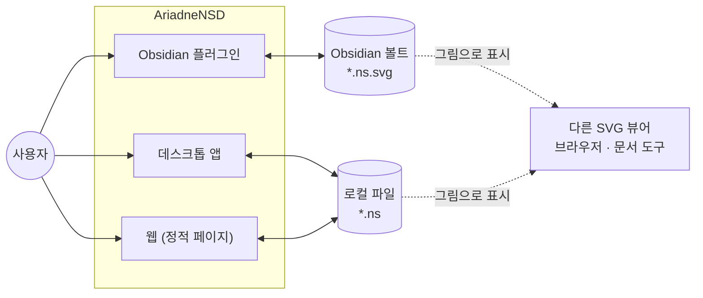
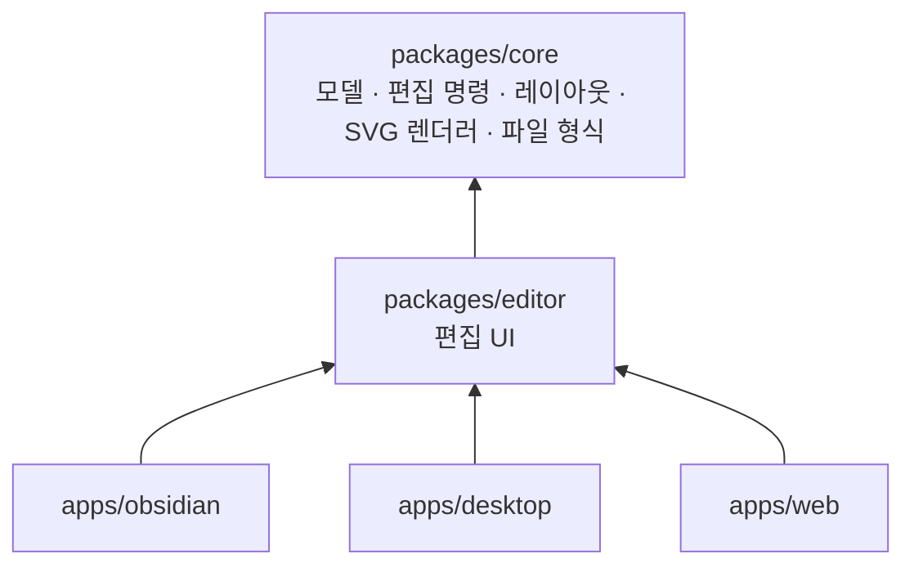
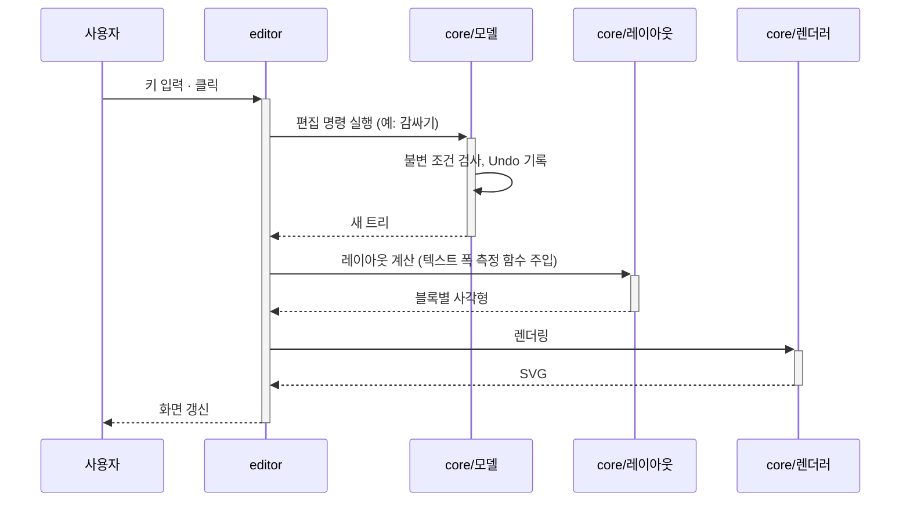

# AriadneNSD 아키텍처 개요

현재 아키텍처를 한눈에 보여 주는 문서입니다. 각 결정의 근거는 ADR에 있고, 세부 설계는 설계 문서에 있습니다. → [[docs/README|문서 색인]]

## 1. 목표와 제약

**품질 목표** ([[01-requirements#4. 비기능 요구사항|비기능 요구사항]])

1. 트리는 어떤 편집 후에도 항상 유효하다. [[01-requirements#^nfr-integrity]]
2. 세 배포 대상이 같은 파일을 주고받고, 같은 모델은 같은 SVG가 된다. [[01-requirements#^nfr-compat]]
3. 핵심 로직(모델·레이아웃·렌더링)은 화면 없이 단위 테스트할 수 있다. [[01-requirements#^nfr-test]]

**제약**

| 제약 | 근거 |
| --- | --- |
| 구현 언어는 TypeScript | [[0003-typescript\|ADR-0003]] |
| Obsidian 플러그인 · 데스크톱 · 웹 세 대상 | [[0002-three-targets-shared-core\|ADR-0002]] |
| 저장 형식은 모델 내장 SVG, 모델은 JSON | [[0005-model-embedded-svg\|ADR-0005]], [[0007-json-serialization\|ADR-0007]] |
| 웹은 서버 없는 정적 페이지 | [[01-requirements#^web-static]] |

## 2. 시스템 컨텍스트

## 3. 구성 요소

공통 패키지와 배포 대상별 셸로 나눈 모노레포입니다. → [[0002-three-targets-shared-core|ADR-0002]]

| 구성 요소 | 책임 | 설계 문서 |
| --- | --- | --- |
| `core` / 모델 | 트리 데이터 구조, 불변 조건 검사, 편집 명령(Undo/Redo) | [[01-model]] |
| `core` / 레이아웃 | 트리 → 각 블록의 사각형 좌표 계산 (순수 함수) | [[02-layout]] |
| `core` / 렌더러 | 레이아웃 결과 → SVG 문자열 | [[02-layout]] |
| `core` / 파일 형식 | 모델 내장 SVG 읽기·쓰기, 버전 변환 | [[01-file-format]] |
| `editor` | 화면 표시, 선택, 텍스트 편집, 키보드·마우스·드래그, 감싸기 | [[03-editor]] |
| `apps/obsidian` | 파일 뷰 등록, `.ns.svg` 판별, 볼트 입출력, 테마 연동 | [[04-obsidian-plugin]] |
| `apps/desktop` | 창, 파일 대화상자, OS 파일 연결 | [[05-desktop]] |
| `apps/web` | 정적 페이지, 브라우저 파일 입출력, 임시 저장 | [[06-web]] |

**의존 규칙**

- 의존은 위 그림의 화살표 방향으로만 흐른다. `core`는 아무것도 모른다.
- `core`는 **DOM과 브라우저 API에 의존하지 않는다.** Node 환경에서 테스트할 수 있어야 한다.
- 배포 대상마다 다른 기능(파일 입출력, 텍스트 폭 측정)은 인터페이스로 정의하고 바깥에서 주입한다.

## 4. 주요 흐름

### 4.1 편집

### 4.2 저장과 열기

- **저장:** 모델 → 레이아웃 → 렌더러로 그림 부분을 새로 만들고, 모델 JSON을 `<metadata>`에 넣어 하나의 SVG로 쓴다.
- **열기:** SVG에서 모델 JSON만 꺼내 읽는다. 그림 부분은 읽지 않는다. 모델이 없으면 편집 불가 안내를 띄운다.
- 자세한 형식은 [[01-file-format]]에 있다.

## 5. 공통 관심사

| 관심사 | 방침 |
| --- | --- |
| Undo/Redo | 모든 모델 변경은 편집 명령(Command)으로만 한다. 명령 단위가 곧 Undo 단위다. |
| 텍스트 폭 측정 | 실행 환경에서만 정확히 잴 수 있으므로 측정 함수를 주입한다. 테스트에서는 고정 폭 측정기를 쓴다. |
| 테마 | 편집 화면 테마와 저장되는 SVG 색상을 분리한다. |
| 다국어 | UI 문자열은 한 곳에서 관리한다 (한국어/영어). |
| 오류 처리 | 손상된 파일은 편집 불가 안내로 끝내고, 원본 파일은 덮어쓰지 않는다. |

## 6. 배포 구성

| 대상 | 셸 | 저장 확장자 | 결정 |
| --- | --- | --- | --- |
| Obsidian 플러그인 | Obsidian 플러그인 API | `.ns.svg` | [[0006-file-extensions\|ADR-0006]] |
| 데스크톱 | Electron 또는 Tauri | `.ns` | [[0009-desktop-framework\|ADR-0009]] (제안됨) |
| 웹 | 정적 호스팅 (GitHub Pages 등) | `.ns` | [[0006-file-extensions\|ADR-0006]] |

## 7. 위험과 검증이 필요한 사항

> [!warning] 텍스트 폭 측정과 "같은 모델 → 같은 SVG"의 충돌
> 레이아웃은 텍스트 폭에 따라 달라지는데, 텍스트 폭은 실행 환경(Obsidian, 브라우저 종류, 데스크톱 웹뷰, OS 글꼴)마다 조금씩 다릅니다.
> 그러면 같은 모델이라도 환경에 따라 다른 SVG가 나와서 [[01-requirements#^nfr-compat]]를 지키지 못합니다.
> 대응 후보: 글꼴을 번들해서 고정, 측정값 반올림, 요구사항을 "같은 환경에서 같은 SVG"로 완화. → [[02-layout]]에서 결정

> [!success] Obsidian에서 `.ns.svg`만 가로채기 (2026-10-10 스파이크로 확인)
> 파일을 여는 순간 이미지 보기를 가로채는 방식으로 `.ns.svg`만 편집기로 열 수 있습니다. 일반 `.svg`는 그대로입니다. 편집 후 노트의 그림 갱신, 그림 우클릭 메뉴도 됩니다.
> 남은 위험: 모두 Obsidian의 공개되지 않은 내부 동작에 기대므로, Obsidian이 업데이트되면 깨질 수 있습니다. → [[04-obsidian-plugin#1. `.ns.svg` 파일 열기]]

> [!question] 웹의 파일 덮어쓰기 지원 범위
> 원래 파일에 덮어쓰기는 Chromium 계열에서만 됩니다. 다른 브라우저에서의 사용 흐름을 [[06-web]]에서 정합니다.

## 8. 결정 목록

모든 ADR은 [[docs/README#아키텍처 결정 기록 (ADR)]]에 있습니다.
