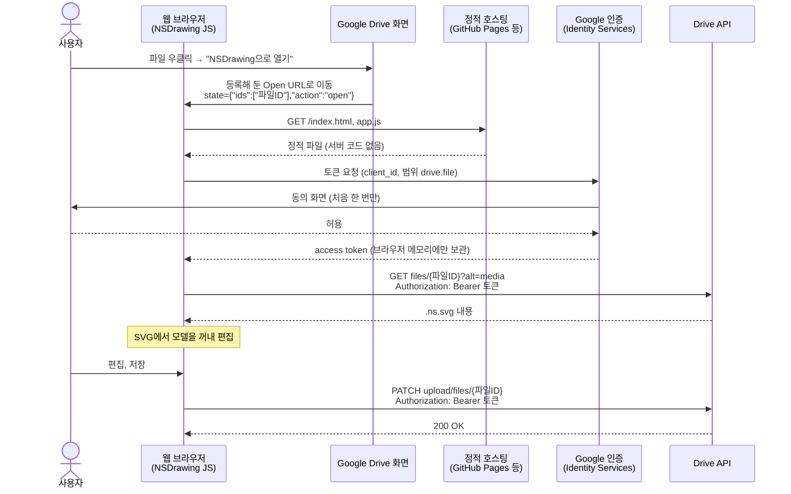

# Google Drive 앱의 기초

## 한 줄 요약

Drive 앱은 Drive 화면에 메뉴를 하나 걸어 두고, 사용자가 누르면 우리 웹 페이지를 파일 ID와 함께 열어 주는 방식이다.

## 백엔드로 비유하면

- **"연결 앱(Open with)"은 웹훅 콜백과 비슷하다.** 미리 등록한 URL(Open URL)로 Drive가 사용자를 보내면서 `state` 파라미터에 파일 ID를 담아 준다.
- **OAuth는 백엔드에서 쓰던 것과 같은 OAuth 2.0이다.** 다만 서버 없이 브라우저에서 토큰을 받는다(Google Identity Services). 그래서 client secret을 둘 곳이 없고, 그 대신 등록한 도메인에서만 동작한다.
- **`drive.file` 범위는 최소 권한 원칙이다.** DB 계정에 테이블 하나만 GRANT하듯, 앱이 만들었거나 사용자가 그 앱으로 연 파일만 접근한다. 범위가 좁으면 Google 심사도 가볍다.
- **파일 저장은 REST 호출 하나다.** `PATCH https://www.googleapis.com/upload/drive/v3/files/{id}`로 내용을 올리면 된다.

## 흐름: Drive에서 열고 저장하기

NSDrawing에는 서버가 없습니다. 정적 호스팅은 HTML과 JS 파일만 내려 주고, 그 뒤의 일은 모두 **웹 브라우저 안의 JS**가 Google과 직접 주고받습니다.

- 백엔드로 치면 브라우저가 **API 클라이언트 겸 서버 역할**을 다 합니다. 토큰이 우리 서버를 거치지 않으니, 우리가 지킬 비밀도 없습니다.
- "새로 만들기" 메뉴도 같은 흐름입니다. `state`의 `action`이 `create`이고, 파일 ID 대신 폴더 ID가 옵니다.

## client secret이란

OAuth에 등록한 **애플리케이션 자신의 비밀번호**입니다. 사용자의 비밀번호가 아닙니다.

- `client_id`는 앱의 아이디, `client_secret`은 앱의 비밀번호에 해당합니다. 백엔드 서버가 Google에 토큰을 요청할 때 둘을 함께 보내서 "이 요청은 정말 우리 서버에서 왔다"고 증명합니다. DB 접속 계정의 비밀번호를 서버 설정에만 두는 것과 같습니다.
- 브라우저에서 도는 JS는 누구나 소스를 볼 수 있습니다. 그래서 비밀을 넣어 둘 수 없습니다. OAuth는 이런 앱을 **공개 클라이언트(public client)** 라 부르고, client secret 없이 동작하게 합니다.
- 대신 Google은 Cloud Console에 등록한 **허용된 JavaScript 출처**(예: `https://nsdrawing.example.com`)에서 온 요청에만 토큰을 줍니다. 다른 사이트가 우리 `client_id`를 훔쳐 써도 출처가 달라서 거절됩니다.

## 확장자와 미리보기 (`.ns` vs `.ns.svg`)

질문: Drive에 `.ns`로 저장하면 썸네일과 미리보기를 별도 작업 없이 보여 준다는 장점이 사라지나?

- **대체로 그렇습니다.** Drive는 파일 형식(MIME)을 보고 미리보기를 만듭니다. 사용자가 올린 `.ns` 파일은 SVG로 인식되지 않으므로, 미리보기를 누르면 "미리보기를 사용할 수 없음"이 나옵니다.
- 썸네일은 앱이 저장할 때마다 PNG를 직접 만들어 함께 올리면(`contentHints.thumbnail`) 보이게 할 수 있습니다. 하지만 저장할 때마다 할 일이 늘고, 다른 도구로 고친 파일은 썸네일이 맞지 않게 됩니다.
- 그래서 Drive에서는 `.ns.svg`가 더 간단합니다. 그래서 `.ns.svg`로 정했습니다. → [[0014-drive-file-extension|ADR-0014]]

## NSDrawing에서 어디에 쓰나

- 웹 버전 위에 Drive 연동을 얹는다. → [[0012-google-drive-integration|ADR-0012]]
- 파일이 SVG라서 Drive가 썸네일과 미리보기를 알아서 보여 준다.

## 더 읽을거리

- [Drive UI integration overview](https://developers.google.com/drive/api/v3/about-apps)
- [Integrate with Drive UI's "Open with" context menu](https://developers.google.com/drive/integrate-open)
- [OAuth 2.0 for Client-side Web Applications](https://developers.google.com/identity/protocols/oauth2/javascript-implicit-flow) — client secret 없이 브라우저에서 토큰 받기
- [Manage file metadata: thumbnails](https://developers.google.com/drive/api/guides/file#uploading_thumbnails) — `contentHints.thumbnail`
